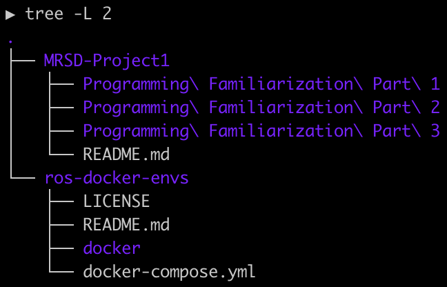

# ros-docker-envs

General purpose docker environment with minimal packages to support GUI visualization and ROS packages.

## Table of Contents
  1. [Overview](#overview)
  2. [High-Level Notes:](#high-level-notes)
  3. [Setup Instructions](#setup-instructions)
      - [GUI Visualization](#gui-visualization)
  4. [Other Notes/Tips](#other-notestips)

## Overview
This repository contains a ROS Melodic Docker environment built on Ubuntu 18.04. Intended as an "environment wrapper"; the repository should be cloned to the same file tree location as the files/directories that will be used with the environment (i.e. as a "sibling" directory, or alternatively a "parent", but NOT a "child"). The container will initialize at that file tree location, in the ROS Docker environment. GUI applications can be visualized using a VNC client pointed to `localhost:5902`. For example, the image below has this repository (`ros-docker-envs`) cloned to the same location as another git repository (`MRSD-Project1`) that holds the code that will be run from inside the container:




## High-Level Notes
- This image uses volumes so the changes you make while in the container will persist outside the container and after you close the docker image. Changes made outside the container will also appear in the container. The container will be able to access all children files/directories as the location where the repository is cloned (from inside the container); use wisely! For more information, see the [Docker volumes documentation](https://docs.docker.com/storage/volumes/).
  - Recommended practice: 
  - 1. Start up a coding environment on local host OS (e.g. VScode).
  - 2. Enter the docker container.
  - 3. Edit files on host coding environment, build/run the files you're working with in the docker container.
- Perform all git operations _outside_ of the container (i.e. on local host OS, in separate terminal outside the container). While in-container git use is possible, compatibility can vary significantly depending on OS and architecture. For example, well-supported environments are Unix-based machines with `x86_64` architecture, but Windows machines can have problems copying git credentials to the container and `ARM` architectures can have problems with `openssh-client` configuration.
- This setup uses VNC to visualize GUI windows generated from the Docker container (e.g. Rviz, PlotJuggler, RQt, etc.). Note that the VNC client must be connected before GUI windows can be generated. The VNC client uses [fluxbox](https://wiki.debian.org/FluxBox) for rudimentary window management. To do so, follow the instructions below for [GUI Visualization](#gui-visualization)
- To change ROS versions, simply change the first line in the `rosenv.dockerfile` to the desired ROS docker image.


## Setup Instructions
1. Clone this repository to the same file hierarchy as the other files/directories you would like to use it with (i.e. should be in the same file tree location as the root of files you would like to work with).


2. Enter top level of this repository.
```
cd ros-docker-envs
```

First, make sure Docker and Docker Compose are installed.
> 1. [Docker Desktop for Mac/Windows](https://docs.docker.com/desktop/) OR [Docker Engine for Linux](https://docs.docker.com/engine/install/#server)
> 2. [Docker Compose](https://docs.docker.com/compose/install/)
> - Once complete, you can verify your installation version by running the following command:
>  ```
>  docker-compose --version
>  ```
> Then, use the following commands to create/activate the environment (after Docker is installed). Make sure to start somewhere in this repository (exact location doesn't matter).

3. Windows/MacOS only: if not already running, start the Docker daemon by opening the Docker Desktop application (the Docker daemon should already be accessible for Linux-based systems).

4. The first time you use the image, you need to build the image. Note that building only needs to be done if you want to update the image. This step will likely take the longest to run; typically 5-30 minutes. Subsequent builds will likely be much shorter because of docker's cache system.
  ```
  docker-compose build
  ```

5. Docker does not have an automatic garbage collection, so every time we build an image more disk space may continue to be taken up by dangling images. To remove any dangling images, run the following command. For more information, see [What are Docker \<none\>:\<none\> images?](https://projectatomic.io/blog/2015/07/what-are-docker-none-none-images/)
  > Note that in some cases no dangling images are generated so you will see an output of `"docker rmi" requires at least 1 argument.`; this is expected.
  ```
  docker rmi $(docker images -f "dangling=true" -q)
  ```

6. Bring the image up in the background. It will be running, but we won't attach to it yet. If you'd like, you can check the result of this step by running `docker-compose ps` before and/or after the command to see the container status. You can also view the container status with the docker desktop app.
  ```
  docker-compose up -d
  ```

7. Attach to a shell in the image. You will now be in the container.
  ```
  docker-compose exec rosenv zsh
  ```
> - To exit the shell when you're done doing in the container, just type `exit` on the command prompt. The docker image will stay active in the background until you do step 9 (you can simply re-attach when you want, by running step 7 again after exiting). Note that changes to the dockerfile need to run step 4 for the changes to take effect (i.e. rebuild).

8. Do work in container. When finished, enter `exit` to leave the container. Note that all "file" work will persist because of the mounted volumes, but package installations will not (i.e. you can still install packages in the container, but they will not remain between down/up cycles. To make the packages persist, add them to the dockerfile and re-build).

9. You generally don't need to shut down the docker container, but if you won't be using it for a while and/or to save resources use while not using it you can use the following command. To re-start the container up again, simply begin with step 6 (i.e. no need to re-build unless dockerfile/etc. changes were made).
  ```
  docker-compose down
  ```

### GUI Visualization
  1) Enter the container (e.g. `docker-compose exec rosenv zsh`, if you haven't already)
  2) Open your VNC client application (e.g. download [VNC Viewer from RealVNC](https://www.realvnc.com/en/connect/download/viewer/))
  3) Connect to the VNC server address (search in the VNC client application for `localhost:5902`)
  4) Start gui appliation in the Docker container, either in VNC window or original container terminal; best practice is to use the original terminal you entered the container from (e.g. `rosrun rviz rviz`, etc.). If running ROS1 commands, remember to have the ros master node running! (i.e. run `roscore` in a separate terminal window; the [tmux](https://www.hamvocke.com/blog/a-quick-and-easy-guide-to-tmux/) tool, already installed in the container, can be helpful for managing terminal windows)

## Other Notes/Tips
- To completely remove _all docker related files from your system_ (e.g. to clear up resources), use the following command. Only non-active containers will be removed (i.e. containers that are "down"; any containers that are "up" will not be affected). Note that this command will clear the Docker build cache, so you will need to re-build any removed images afterwards. See the Docker documentation for more information about [pruning to reclaim space](https://docs.docker.com/config/pruning/), and/or [managing file system storage for Mac](https://docs.docker.com/desktop/mac/space/).
  ```
  docker system prune -a --volumes
  ```
- You can check the status of containers using `docker-compose ps`, or with the desktop app.
- The `docker-compose.yml` file defines how the dockerfile(s) get called. You can add new system packages to the bottom of `rosenv.dockerfile`, or make a new custom dockerfile and reference it from the desired service in the `docker-compose.yml` file.
- If desired, you can add an additional arguement for the image name (e.g. `my_custom_rosenv`) with steps 4, 7, and 9 to apply `docker-compose` commands to only that service. Service must exist in `docker-compose.yml`. Step 7 always requires specification of an image name.
